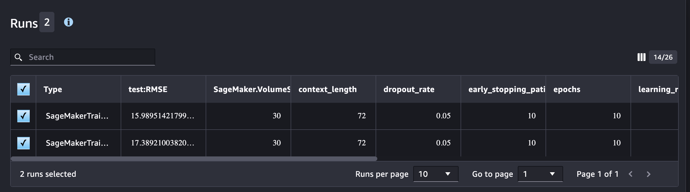
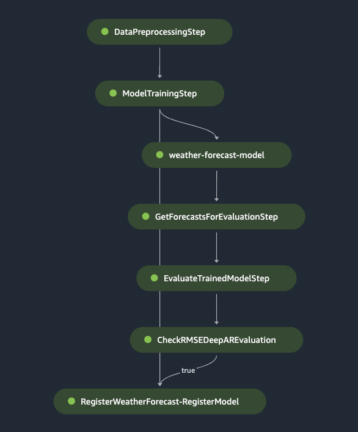

# electric-weather

<p align="center">
  
</p>
<p align = "center">
Photo by <a href="https://unsplash.com/@densaldanha?utm_content=creditCopyText&utm_medium=referral&utm_source=unsplash">Denver Saldanha</a> on <a href="https://unsplash.com/photos/a-grassy-hill-with-power-lines-in-the-distance-75jQCOTi_EQ?utm_content=creditCopyText&utm_medium=referral&utm_source=unsplash">Unsplash</a>
</p>

Greetings!


# Data Sources

+ Weather Data
    + https://api.weather.gov
    + https://www.weather.gov/documentation/services-web-api
+ Electricity
    + https://www.eia.gov/opendata/browser/electricity


_CURL requests_
- Forecast: https://api.weather.gov/zones/Feature/OHZ055/forecast
- Current Measurements: https://api.weather.gov/zones/forecast/OHZ055/observations
- Electricity Price: "https://api.eia.gov/v2/electricity/retail-sales/data?api_key=<api_key>&frequency=monthly&data[0]=customers&data[1]=price&data[2]=revenue&data[3]=sales&facets[stateid][]=OH&start=2023-01&end=2023-05&sort[0][column]=period&sort[0][direction]=desc&offset=0&length=5000"

# ETL

1. Get data from API (source data), save to S3 (lambda)
2. Preprocess files on S3 into raw data
3. Preprocess raw data on S3 and split into train and test data

# AWS Services and Tools

+ AWS S3: Storage for data.
+ AWS SNS: Subscription services
+ AWS Cloudwatch: Watches for lambda function errors and communicates to user.
+ AWS Lambda: Executes python script to get data from open APIs and save to storage.
+ AWS EventBridge: Service to trigger AWS Lambda functions.
+ AWS Elastic Container Registry (ECR)
+ AWS Sagemaker: Pipelines for Machine Learning
+ AWS Identity and Access Manager (IAM)
+ AWS Code pipeline: CI/CD services
+ AWS Secrets Manager: Maintains the API key secret, gets rotated by AWS Lambda
+ AWS SAM

## AWS S3

```
|-- first bucket
|   |-- observations
|   |   |-- <zone>_<date>.json
|   |   |-- ...
|-- second bucket
|   |-- deep_ar
|   |   |-- data
|   |   |   |-- raw
|   |   |   |   |-- ...
|   |-- output
|   |   |-- model artifacts
|   |   |-- predictions
|-- third bucket
|   |-- deep_ar
|   |   |-- data
|   |   |   |-- train
|   |   |   |-- test
```

## AWS SNS Subscriptions

Email subscription for budget.

## AWS CloudWatch Alarms

Lambda function alarm for function error.

## AWS Lambda Functions

+ Need to add a Layer for the pandas function.
+ Each function is triggered by the previous function and writes logs to cloudwatch.

get_weather_data -> preprocess_weather_data -> train_test_split_weather_data

**get_weather_data** : Gets the data from the API request.
**preprocess_weather_data** : Preprocessing the API request JSON data into just feature data.
**train_test_split_weather_data** : Gathers preprocessed data and creates a training and test dataset.
Each training set needs >= 300 observations
Each observation is roughtly 1 hour, so we keep 24 observations as a hold-out set for testing.
**weather_forecast_batch_transform** : Gets forecasts from the trained model.

### AWS EventBridge

+ Daily Event Trigger
+ Every 3 days Trigger

## AWS Elastic Container Registry (ECR)

**Docker**

`~ % docker build -t <> -f ./ml_preprocessing_dockerfile . --platform=linux/amd64`

## AWS Sagemaker

A single domain with Sagemaker Studio.

## AWS Identity and Access Manager (IAM)

**User Profiles**
+ Data Scientist
+ ML Ops Engineer

# AWS CodeBuild CI/CD


## Continuous Integration and Development Pattern

For CI/CD, I utilize a **Model Training Pipeline** and a **Model Deployment Pipeline**

Model Training Pipeline: https://github.com/caseywhorton/deep-ar-mlops-project

## Model Development Cycle

Experimentation by a data scientist can fit into this pattern. AWS Sagemaker has a suite of tools that assists in experimentation. Within Sagemaker Studio, there are convenient ways to organize machine learning experimentation. Although not in a directory structure, I like to think of the parts of sagemaker studio like below:

```
|   |-- Projects
|   |   |-- Repositories
|   |   |-- Experiments
|   |   |   |-- Pipelines
|   |   |   |   |-- Run Groups
|   |   |-- Model Groups
|   |   |   |-- Run Groups
|   |   |   |-- Model Registry
```

**Experiment Runs**

<p align="center">
  
</p>

For experiment runs, filtering on the `SageMakerTrainingJob` shows model metrics such as the `test:RMSE` for ranking models. Hyperparameters are also displayed.  Adding a feature set would be a helpful set of information for each experimental run. Using the **Run Group**, we have to manually promote the best model to deployment within the **Model Group**.

**Pipeline Runs**

The sequential steps in the machine learning pipeline are executed by a Sagemaker pipeline.

For the model training and registration pipeline, we execute these steps:

<p align="center">
  
</p>

# Machine Learning

JSON Document Format for Deep AR:

{"start":<timestamp>, "relative_humidity": [...]}
{"start":<timestamp>, "wind_speed": [...]}

In order to train the deep AR model, we need at least 300 observations. A single day of observations from a single station has about 72 observations. So, we need several days of observations.

## Weather Model Target and Evaluation

There are multiple targets of interest, mainly the temperature and humidity of the environment. These targets, during the summer months especially, can have an impact on the electricity usage in an area. This project utilizes an deep learning time series algorithm called Deep AR, and on AWS this algorithm trains and predicts on all input features.

The documentation on the DeepAR input/output reveals the metric used to evaluate the model during training. The root mean squared error (RMSE) is calculated over all of the series that are being evaluated, and the formula is a little different than the usual RMSE calculated over a single set of predictions:

$ RMSE = \sqrt{\frac{1}{nT}*\sum_{i,t}(\hat{y}_{i,t}-y_{i,t})^2} $

## Electric Model Target and Evaluation


## Model Deploy
