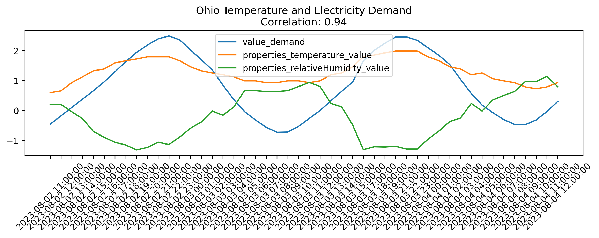
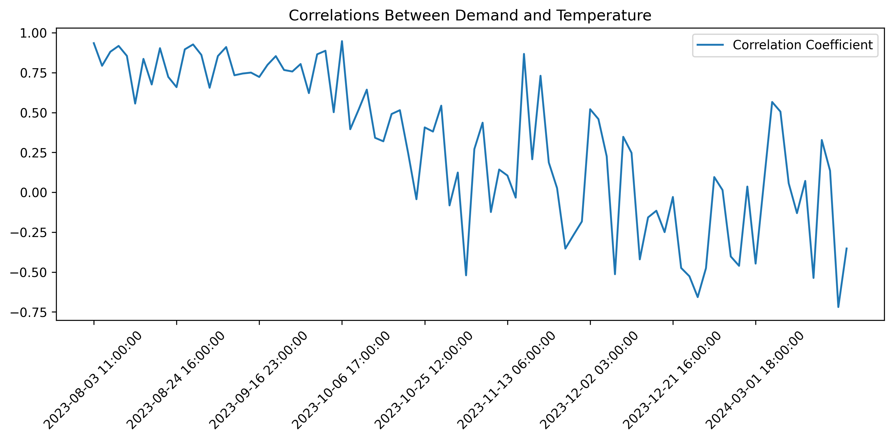

# electric-weather

  

Photo by <a href="https://unsplash.com/@densaldanha?utm_content=creditCopyText&utm_medium=referral&utm_source=unsplash">Denver Saldanha</a> on <a href="https://unsplash.com/photos/a-grassy-hill-with-power-lines-in-the-distance-75jQCOTi_EQ?utm_content=creditCopyText&utm_medium=referral&utm_source=unsplash">Unsplash</a>

Every year, the months of summer demand an increase in electrical consumption to cool our houses. This project aims to explore the relationship between electrical demand and weather and one day answer questions about the capacity and pricing of electricity in our changing world.  This is also an opportunity to gain hands-on experience with continuous development, machine learning operations, and longitudinal work and planning.  The majority of the work is completed on Amazon Web Services (AWS), which gives me an opportunity to learn more about the platform.

This project uses two repositories with hooks into AWS Sagemaker Pipelines, Model Registry, CodeBuild and CodePipeline:
+ [deep-ar-mlops-project](https://github.com/caseywhorton/deep-ar-mlops-project): Defines the Model training and registration pipeline.  
+ [deep-ar-mlops-project-deploy](https://github.com/caseywhorton/deep-ar-mlops-project-deploy): Defines the Model deployment process using AWS Serverless Application Model and AWS Lambda.  

This README is broken into sections with subsections:
+ [Data Sources](#data-sources) 🪣
+ [ETL (Extract, Transform & Load)](#etl) 🏗️
+ [AWS Services and Tools](#aws-services-and-tools) 🧰
+ [Model Train](#model-train) ⚙️
+ [Model Deploy](#model-deploy) 🚀
+ [DevOps](#devops) 🪄

# Data Sources

+ Weather Data
    + https://api.weather.gov
    + https://www.weather.gov/documentation/services-web-api
+ Electricity
    + https://www.eia.gov/opendata/browser/electricity
    + ...

_CURL requests_
- Forecast: https://api.weather.gov/zones/Feature/OHZ055/forecast
- Current Measurements: https://api.weather.gov/zones/forecast/OHZ055/observations
- Electricity Price: "https://api.eia.gov/v2/electricity/retail-sales/data?api_key=<api_key>&frequency=monthly&data[0]=customers&data[1]=price&data[2]=revenue&data[3]=sales&facets[stateid][]=OH&start=2023-01&end=2023-05&sort[0][column]=period&sort[0][direction]=desc&offset=0&length=5000"

# Analysis

** Electricity Demand

Demand is measured in megawatthours, and to correlate with the weather in Ohio, we are using the PJM data.

  

** Temperature

Demand is measured in degrees Celsius from the weather station in Columbus, Ohio.

  

** Correlating Temperature and Electricity Deamnd

In the month of August, we can see the correlation is strong.

  

In the fall and winter, we can see the correlation is not as strong and the relationship is a little more complicated.

  

Over time, we can look at the correlation between electricity and demand over rolling 48-hour periods.

  

# ETL

Extract transform and load.

1. Get data from API (source data), save to S3 (lambda)
2. Preprocess files on S3 into raw data
3. Preprocess raw data on S3 and split into train and test data

# AWS Services and Tools

+ AWS S3: Storage for data.
+ AWS SNS: Subscription services
+ AWS Cloudwatch: Watches for lambda function errors and communicates to user.
+ AWS Lambda: Executes python script to get data from open APIs and save to storage.
+ AWS EventBridge: Service to trigger AWS Lambda functions.
+ AWS Elastic Container Registry (ECR)
+ AWS Sagemaker: Pipelines for Machine Learning
+ AWS Identity and Access Manager (IAM)
+ AWS Code pipeline: CI/CD services
+ AWS Secrets Manager: Maintains the API key secret, gets rotated by AWS Lambda
+ AWS SAM (Serverless Application Model)

## AWS Lambda Functions

This project uses several lambda functions for serverless computation in the data pipeline.  These functions run on either a trigger or schedule written and saved in AWS EventBridge.

**get_weather_data** : Gets the data from the API request. Runs on a schedule.  
**preprocess_weather_data** : Preprocessing the API request JSON data into just feature data.  
**train_test_split_weather_data** : Gathers preprocessed data and creates a training and test dataset.  
_Note: Each training set needs >= 300 observations_  
_Note: Each observation is roughtly 1 hour, so we keep 24 observations as a hold-out set for testing._  
**weather_forecast_batch_transform** : Gets forecasts from the trained model.  

## AWS Elastic Container Registry (ECR)

**Docker**

`~ % docker build -t <> -f ./ml_preprocessing_dockerfile . --platform=linux/amd64`

## AWS Sagemaker

Sagemaker is used for model definition, training, versioning and monitoring. Within Sagemaker, there are several tools used in this project, including:

+ [Sagemaker Pipelines](https://docs.aws.amazon.com/sagemaker/latest/dg/pipelines-sdk.html)
+ [Sagemaker Studio](https://aws.amazon.com/sagemaker/studio/)
+ [Model Registry](https://docs.aws.amazon.com/sagemaker/latest/dg/model-registry.html)

# Model Train

## DeepAR Algorithm
The DeepAR algorithm, part of Amazon SageMaker suite, is a sophisticated forecasting model from AWS designed for time series predictions. It's tailor-made for both single and multiple types of time-based data. Given its proficiency in forecasting and managing various data streams, I think it's a perfect match for predicting temperature and similar features.

For more details, check out the [DeepAR Algorithm documentation](https://docs.aws.amazon.com/sagemaker/latest/dg/deepar.html).

## Training Data

JSON Document Format for Deep AR:

{"start":<timestamp>, "relative_humidity": [...]}
{"start":<timestamp>, "wind_speed": [...]}

In order to train the deep AR model, we need at least 300 observations. A single day of observations from a single station has about 72 observations. So, we need several days of observations.

## Weather Model Target and Evaluation

There are multiple targets of interest, mainly the temperature and humidity of the environment. These targets, during the summer months especially, can have an impact on the electricity usage in an area. This project utilizes an deep learning time series algorithm called Deep AR, and on AWS this algorithm trains and predicts on all input features.

The documentation on the DeepAR input/output reveals the metric used to evaluate the model during training. The root mean squared error (RMSE) is calculated over all of the series that are being evaluated, and the formula is a little different than the usual RMSE calculated over a single set of predictions:

  

# Model Deploy
After successful training and evaluation, deploying the model becomes crucial. [Here is a link to the deployment repository](https://github.com/caseywhorton/deep-ar-mlops-project-deploy).  Here's an overview of the deployment process:

## Model Packaging
The trained models are serialized and packaged into a format suitable for deployment. In this process, the model artifacts, configurations, and dependencies are bundled together for seamless deployment.

## Deployment Strategy
This model can be deployed on Sagemaker and made available for batch transform jobs. This isn't a real-time inference model yet, so it is unecessary to have an endpoint configured or live. Instead, a lambda function is updated with the name of the most recently deployed model. During inference, the lambda function with run the batch transform job configured with a destination in Amazon S3 for model predictions.

## Documentation and Model Versioning
In addition to maintaining comprehensive documentation that outlines the functionalities and endpoints of deployed models, managing SageMaker Model Package Groups and Versions is crucial. Model Package Groups are a way to organize and group models, facilitating easier management, monitoring, and versioning. These groups allow for logical organization and tracking of different versions of a model, making it simpler to compare performance and manage updates over time. By leveraging SageMaker's model packaging capabilities, teams can efficiently version their models, ensuring transparent tracking, easier collaboration, and informed decision-making for future enhancements.

# DevOps

  

For CI/CD, I utilize a **Model Training Pipeline** and a **Model Deployment Pipeline**

## Model Development Cycle

Experimentation by a data scientist can fit into this pattern. AWS Sagemaker has a suite of tools that assists in experimentation. Within Sagemaker Studio, there are convenient ways to organize machine learning experimentation. Although not in a directory structure, I like to think of the parts of sagemaker studio like below:

**Experiment Runs**

  

For experiment runs, filtering on the `SageMakerTrainingJob` shows model metrics such as the `test:RMSE` for ranking models. Hyperparameters are also displayed.  Adding a feature set would be a helpful set of information for each experimental run. Using the **Run Group**, we have to manually promote the best model to deployment within the **Model Group**.

**Pipeline Runs**

The sequential steps in the machine learning pipeline are executed by a Sagemaker pipeline.

For the model training and registration pipeline, we execute these steps:

  

